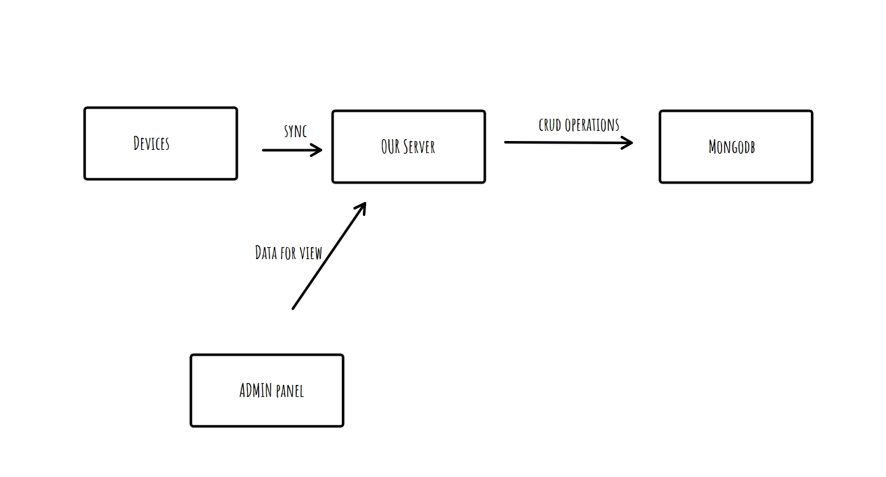

# Project Name

A full-stack application with a React Vite.js frontend and an Express.js backend, connected to a MongoDB database.

## Project Structure

- **client/**: React frontend built with Vite.js
- **server/**: Express.js backend API

## Prerequisites

- Node.js (v16 or higher)
- MongoDB (local or cloud instance)
- npm or yarn

## Setup Instructions

### 1. Clone the Repository

```bash
git clone https://github.com/saurabhk79/pw-assignment
cd https://github.com/saurabhk79/pw-assignment
```

### 2. Client Setup

```bash
npm install
npm run dev
```

### 3. Server Setup

```bash
npm install
npm run dev
```


Questions
A short system diagram (how PiSync devices, APIs, and dashboard interact)?



One-page doc on how you would improve it if we had 50,000 devices syncing daily.

[Answer here](https://drive.google.com/file/d/1sjxKhcvhCnIK5FKGg8OwQr87KCSrr0n3/view?usp=sharing)